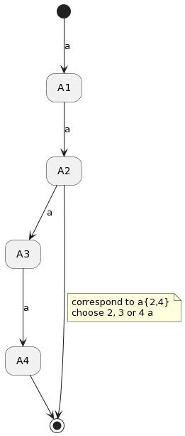

# COMPUTER SCIENCE COURSES

## TABLE OF CONTENTS

## INTRODUCTION

Computer Science is a wonderfull science. Indeed, this science is logical and use algorithm to execute some instruction. The first thing to do is to choose a language to develop some program with it. Bellow, you have a list of most use and popular computer sciences language and their uses :
- Python : Artificial Intelligence and Machine Learning (easy)
- JavaScript : Interaction on Web Development (easy)
- Java : Application Development (intermediate)
- R : Data Analysis (intermediate)
- C : All kind of Development (intermediate to advanced)
- C++ : All kind of Development (easy to intermediate)
- C# : Application and Web Development (intermediate)
- Go : Server-Side Development (easy to intermediate)
- PHP : Web Development (easy)
- SQL : Data Managment (easy)
- Swift : Mobile App Development on iOS (easy)
- Dart : Application Development (easy)
- Kotlin : Mobile App Development on Android OS (easy)
- Perl : Text Development (easy)
- Ruby : Application Development (easy)
- Rust : Application Development (intermediate to advanced)
- Scala : Cloud-Based Application Development (intermediate)

But first of all, it's important to prepare your computer to use language. In each folders bellow, you have a README file associate with an installing part :
- `learn-python/`
- `learn-javascript/`
- `learn-java/`
- `learn-c/`
- `learn-c++/`
- `learn-php/`
- `learn-sql/`

### GIT

Furthermore, a good programmer know essential GIT commands :
- `git clone https://github.com/username/repo.git` : You do it when you want to get a GIT project on your computer
- `git add .` : You do it first to add all modified and/or new files to your next commit
- `git commit -m "Your message"` : You do it after you add all files to present to your GIT project what you want to push
- `git push` : You do it last to push on your GIT project all your files
- `git push https://github.com/your-username/yourrepo.git` : You do it when it's your first push with GIT and when you generate a personnal access token (<https://github.com/settings/tokens>)
- `git pull` : You do it when you want to get the last update of the project
- `git status` : You do it you check if your up to date or no
- `git checkout -b branchname` : You do it when you want to create a new branch on your GIT project
- `git checkout branchname` : You do it when you want to switch on the *branchname* branch of your GIT project
- `git branch` : You do it when you want to list all your GIT project's branch
- `git branch -d branchname` : You do it when you want to delete the *branchname* branch of your GIT project
- `git merge branchname` : You do it when you want to merge the *branchname* branch of your GIT project when your current branch
- `git diff` : You do it when you want to list all conflict you have before merging

To conclude this part, it's important to know the existance of some git file and folder :
- `.git` folder is your GIT project folder. Do not take attention on it.
- `.gitignore` file is what your GIT project ignore when pushing. You add one element per row. Using regular expression is usefull when you want to generalize some ignore files folders

```
#Example of .gitignore file

#Ignore csv file
*.csv

#Ignore D2 folder
/csv/**/D2
```

- `README.md` file is what your GIT projects show when a user is on your GIT project web page

```md
# README EXAMPLE

## TABLE OF CONTENTS

- [MEANING](#meaning)
  * [COURSES](#courses)
  * [PROJECTS](#projects)
- [AUTHORS](#authors)
- [LICENSES](#licenses)
  * [LICENSE OF OUR DATASET](#license-of-our-dataset)
- [SOURCES](#sources)

<small><i><a href='http://ecotrust-canada.github.io/markdown-toc/'>Table of contents generated with markdown-toc</a></i></small>

## MEANING

### COURSES
To see all courses who used this dataset for example, you need to go in this folder :
- `courses/`

### PROJECTS
To see all projects based on this dataset, you need to go in this folder :
- `projects/`

## AUTHORS
- Yotlan LE CROM (<https://github.com/Yotlan>)
- Endy YU (<https://github.com/endyappel>)
- Samuel PENAULT (<https://github.com/Samuel-Penault>)

## LICENSES
- CC BY-NC-SA 4.0 (FBREF from Sports Reference)
- CC BY-SA 3.0 (Wikipedia)
- CC BY-NC-SA 4.0 (ENFA)

### LICENSE OF OUR DATASET
- CC BY-NC-SA 4.0

## SOURCES
- FBREF (<https://fbref.com/fr/>) from Sports Reference (<https://www.sports-reference.com>) for csv files in `csv/England/D1/Premier_League/equipes/*/*.csv` and `csv/England/D1/Premier_League/saisons/*.csv`
- Wikipedia (<https://en.wikipedia.org/wiki/Main_Page>) for csv files in `csv/England/D1/Premier_League/*.csv` and `csv/England/D1/Football_League_First_Division/saisons/*.csv`
- ENFA (<https://www.enfa.co.uk/>) for csv files in `csv/England/D1/Football_League_First_Division/equipes/*.csv`
```

### REGULAR EXPRESSION

It's something very important in computer science. Indeed, if you want to generalize choose of some folders, files or expressions, it's important to know regular expression. The following table explain how regular expression symbol work :

| Symbol | Match                                 |
|--------|---------------------------------------|
| .      | Any character                         |
| ^      | The starting symbol                   |
| $      | The last symbol                       |
| [ ]    | Set of matching character             |
| [^ ]   | Set of no-matching character          |
| ( )    | Sub expression                        |
| *      | Between 0 and INFINITE                |
| +      | Between 1 and INFINITE                |
| ?      | Between 0 and 1                       |
| {M,N}  | Between M and N                       |
| \|     | First expression or second expression |

We see some example to understand correctly how regular expression work (with the representation to an automaton).

__**Example 1 :**__


Here we can see that we can enter whatever one symbol, it was accept.

__**Example 2 :**__


Here we can see that we can enter the number of a we want (0 or n), it was accept. But other symbol ar not accept. 

__**Example 3 :**__


Here it's the same pattern that previous part, but we need at least one a to be accept.

__**Example 4 :**__


Here we can see that we can enter 0 or one a only to be accept.

__**Example 5 :**__


Here we can see that we can enter a or b to be accept.

__**Example 6 :**__



Here we can see that we can enter at least 2 a and at most 4 a to be accept.

__**Example 7 :**__


Here we can see that we can enter only word begin with an a following by whatever symbol to be accept.

__**Example 8 :**__


Here we can see that we can enter only word start with whatever symbol following and end by one a  to be accept.

__**Example 9 :**__


Here we can see that we can enter only a b or c to be accept.

__**Example 10 :**__


Here we can see that we can enter only d, e, ... or z. a b and c are not accept.

__**Special example :**__
The use of ( ) are to reffer these sub groups later in code (by use $1 or \1 (depending on the implementation) )

Input :

```
#input.example

string string1 = "Hello World"
if string1 match (H..).(o..)
  print "We matched '$1' and '$2'."
```

Output : 

```
run input.example
> We matched 'Hel' and 'o W'.
```

(This example if from Wikipedia (<https://en.wikipedia.org/wiki/Regular_expression>) )

### LINUX COMMANDS

It's important to know essantial Linux commands. To do it on Windows, I recommanded you to install the built-in Ubuntu version for Windows 10 (<https://www.microsoft.com/store/productId/9PNKSF5ZN4SW> or type ubuntu on the Microsoft Store). 

#### INSTALL UBUNTU ON WINDOWS 10

Follow these steps to correctly install Ubuntu on Windows 10 :
- Launch with administrator power the **Microsoft PowerShell** application
- Run the following command in the powershell terminal : `wsl --install` or `wsl --install -d ubuntu` (the last command is to install WSL and Ubuntu at the same time)
- If you run the first command bellow, download Ubuntu on the Microsoft Store (<https://www.microsoft.com/store/productId/9PNKSF5ZN4SW> or type ubuntu on the Microsoft Store)
- Launch **Ubuntu** application (type ubuntu in the search bar)
- **Take care to put a username and a password you remember**
- Run the following command in the ubuntu terminal : `sudo apt update`
- Run the following command in the ubuntu terminal : `sudo apt upgrade` and then type Y when the terminal ask you between Y or n

After that, you successfully install Ubuntu on Windows 10 ! (the original tutorial are from <https://ubuntu.com/tutorials/install-ubuntu-on-wsl2-on-windows-10#1-overview>)

#### LIST OF LINUX COMMANDS

| Command | Explanations                                                                                                                                                                                                                                                                               | Example                                                                                                                                                                                                                                                                                                                                                                                                               |
|---------|--------------------------------------------------------------------------------------------------------------------------------------------------------------------------------------------------------------------------------------------------------------------------------------------|-----------------------------------------------------------------------------------------------------------------------------------------------------------------------------------------------------------------------------------------------------------------------------------------------------------------------------------------------------------------------------------------------------------------------|
| cd      | Move into the folder's tree                                                                                                                                                                                                                                                                | cd .. : back to the previous folder in the folder's tree<br>cd folder1 : go to the folder1 if it is present in the current folder<br>cd ~ : go to the source folder<br>cd folder1/folder2 : go to the folder2 into the folder1 if this path exist<br>cd ../.. : back to the 2 previous folder in the folder's tree                                                                                                    |
| ls      | Show all files and folders in the current folder                                                                                                                                                                                                                                           | ls<br>> folder1 folder2 file1.java file2.cpp                                                                                                                                                                                                                                                                                                                                                                          |
| mkdir   | Create a folder in the current folder                                                                                                                                                                                                                                                      | mkdir folder1                                                                                                                                                                                                                                                                                                                                                                                                         |
| rmdir   | Delete a folder in the current folder (only if it was empty)                                                                                                                                                                                                                               | rmdir folder1                                                                                                                                                                                                                                                                                                                                                                                                         |
| touch   | Create a files in the current folder                                                                                                                                                                                                                                                       | touch file1.java : Create file1.java in the current folder<br>touch ../file1.java : Create file1.java in the previous folder <br>in the folder's tree<br>touch folder1/file1.java : Create file1.java in folder1 if it exist                                                                                                                                                                                          |
| rm      | Delete a file in the current folder                                                                                                                                                                                                                                                        | rm file1.java<br>rm ../file1.java : Delete file1.java in the previous folder in the folder's tree<br>rm folder1/file1.java : Delete file1.java in folder1 if it exist                                                                                                                                                                                                                                                 |
| chmod   | Give some permissions on folders/files (see all possibilities on this [link](<https://www.pluralsight.com/blog/it-ops/linux-file-permissions#:~:text=To%20change%20directory%20permissions%20in%20Linux%2C%20use%20the%20following%3A,filename%20to%20allow%20executable%20permissions.>)) | chmod u+r file1.java : Add the right to **R**ead file1.java to **U**sers<br>chmod u-r file1.java : Remove the right to **R**ead file1.java to **U**sers<br>chmod a+rw file1.java : Add the right to **R**ead and **W**rite in file1.java to **A**ll<br>chmod a-w file1.java : Remove the right to **W**rite file1.java to **A**ll<br>chmod u=x file1.java : Add only the right to e**X**ecute file1.java to **U**sers |

## DATASTRUCTURES

To be good in computer sciences, pratice is important ! But you also need to know some computer science's theory, especially about how data structure work or all logic behind computer sciences languages.

### LIST, STACK AND QUEUE

Lists are very usefull to stock some datas. Indeed, add, remove and read in a list is very easy (not when you do it in parallel, but it's another problem). 

Input :

```
#input.example

string list1 = []
list1[0] = "Hello"
list1[1] = "World"
print "list1 size : " list1.size()
for i from 0 to list1.size()
  print "list1["i"] : " list1[i]
```

Output :

```
run input.example
> list1 size : 2
> list1[0] : Hello
> list1[1] : World
```

But we can do stack (like a stack of pancakes) and queue (like when you are waiting to by the last FIFA games). In stack you can only add at the top of it and remove like the same manners. In queue, you add at the end of it and remove the first of it. It's very usefull data structures, especially when you want to do some applications.


*Take image from <https://tutsmaster.org/how-to-represent-stack-in-c-data-structure/>*

### TREE

Bellow we talk about folder's tree. But what is a tree ? A tree is a powerfull datastucture who work with pointer (or references with Java). But what is a pointer ? A pointer is a link with another object. The image below explain how a list work with pointer :


*Take image from <https://walkingtechie.blogspot.com/2018/12/inserting-node-in-singly-linked-list.html>*

It's very usefull to create powerfull datastructure. The image bellow is an example how a binary tree work with pointer :


*Take image from <https://codescracker.com/c/c-trees.htm>*

With the image above, you can see how we can use a tree, but you can use tree (not necessarely binary (tree with at most 2 branch)) to create your own datastructure.

### GRAPHS

The last datastructures we see in this part. You see how tree work, and trees are graphs (but graphs are not especially trees). In graph field, we can see 2 type of graph : Directed Graph and Undirected Graph. The image bellow explain the difference between these 2 types of graphs :


Indeed, Directed Graph work with arrow, where Undirected not work with them, but in practice, you see that type of graph work with arrow : S -> T and T -> S = S -- T. So you can use, in both case, pointer (or reference) we explain before, but don't forget that : **each edge (line) between 2 nodes represent 2 arrows following the rule I explain before in Undirected Graph**. 

*Take image from <https://stackoverflow.com/questions/20556802/determining-whether-or-not-a-directed-or-undirected-graph-is-a-tree>*

## CLASS AND INTERFACE

Class and interface is very usefull when you want to create your own type. It's a base of OOP (Object-Oriented Programming). The image bellow explain how interface and class can work together :


Indeed, a interface is a "void" class who define a more general type. With that, you can do this code bellow :

Input :

```
#input.example

Club list1 = []

#Add all Football Club

list1[0] = Arsenal
list1[1] = ManchesterCity 
list1[2] = Liverpool 
...

#Add all Basketball Club

list1[3] = ChicagoBulls
...

for i from 0 to list1.size()
  print "Club name : " list[i].getName()
```

Output :

```
run input.example
> Club name : Arsenal
> Club name : ManchesterCity
> Club name : Liverpool
> Club name : ChicagoBulls
```

## ALGORITHMS

Algorithm is the main subject in computer science. Indeed, without them, we can't do computer sciences. In this part, we explain the difference between iterative and recursive algorithm.

### ITERATIVE AND RECURSIVE ALGORITHM

It's a very important notion. Indeed, Iterative and recursive algorithm can do the same action, but not in the same way. For example, the code bellow increment a variable from 0 to 3 :

Input :

```
#input.example

print "Iterative version"
for i from 0 to 3
  print i

print "Recursive version"
display(int i)
  if i <= 3
    print i
    display(i+1)

display(0)
```

Output :

```
run input.example
> Iterative version
> 0
> 1
> 2
> 3
> Recursive version
> 0
> 1
> 2
> 3
```

Indeed, with this code, you can see that with the iterative version all the steps are "show", but it's not the case of the recursive version. It's pretty complicated to understand a recursive algorithm sometime, more than a iterative algorithm. To conclude, sometimes it's better to use iterative algorithm and much more easy to understand, but sometime it's the recursive algorithm who is better to understand and write. So **adapt your algorithm to your mind**.