# LATEX COURSES

## TABLE OF CONTENTS

## GETTING START

Write a report with LaTeX is very usefull. In this short courses, I share you my personnal LaTeX template to write report. But first of all, you need to go on Overleaf website (by clicking on this link <https://fr.overleaf.com>) and create an account (or connect on it). When you do that, go on this link <https://fr.overleaf.com/project> and your normally see all your report, call here "project". You can start a project by clicking on the green button *New project* and select *Empty project*. When you do this, you normaly arrive in a page like this :

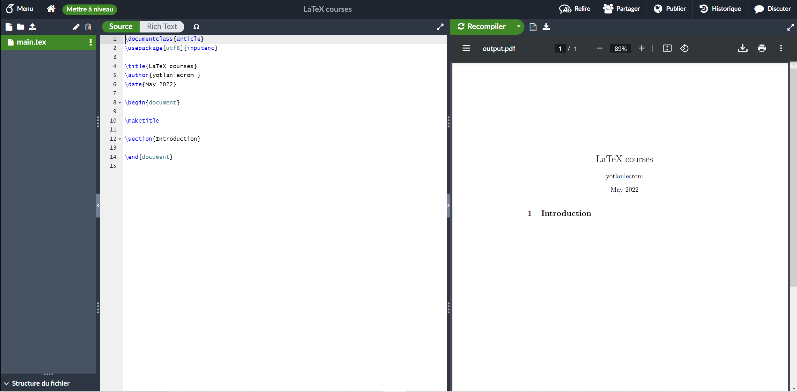

Here it's the french version, but do not care about it. What is important is the render of this page. You can see lot of things like *Recompile* or *Share*. If you want to allow someone to read or write on your LaTeX document, click on *Share* button and you get a pop up windows like this :

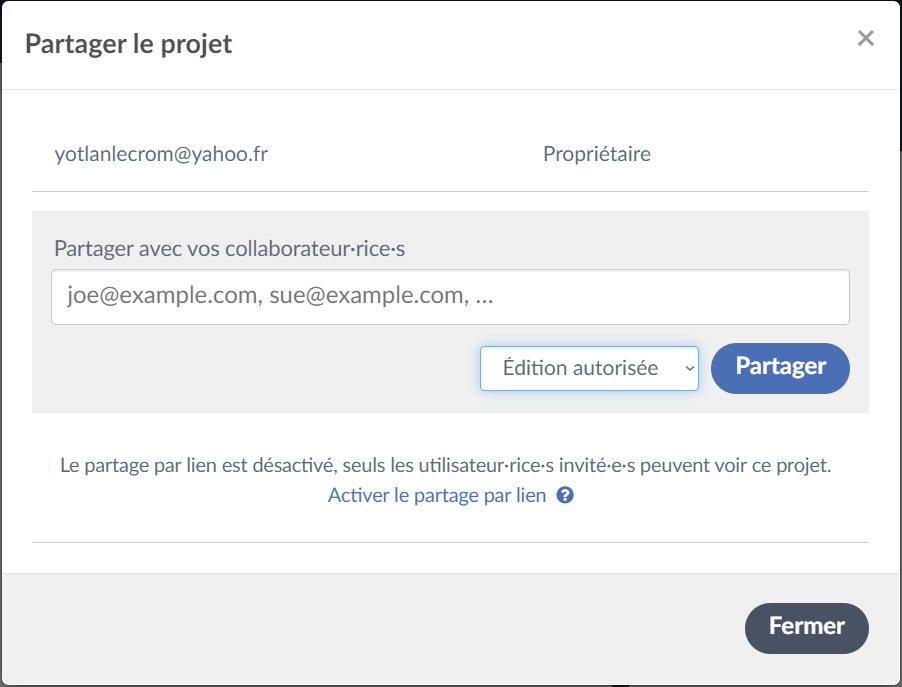

Here you can decide to add by hand people who can read/write on your report by adding their mail (and so by doing this, you send an invitation to the other user who need to accept if he want to read/write). But you can decide to share your report with other people by clicking on *Activate link sharing*. Once you doing this, you can close the pop up windows.

Before we start, the full example of this courses is present in `ex/report.tex`.

## COVER PAGE

If you don't want a cover page in your report, skip this part. Cover page is important to give a good impression to your reader. Indeed, you need to do a very good cover page with the maximum information you can give. Bellow, I give you an example of a cover page you can do :

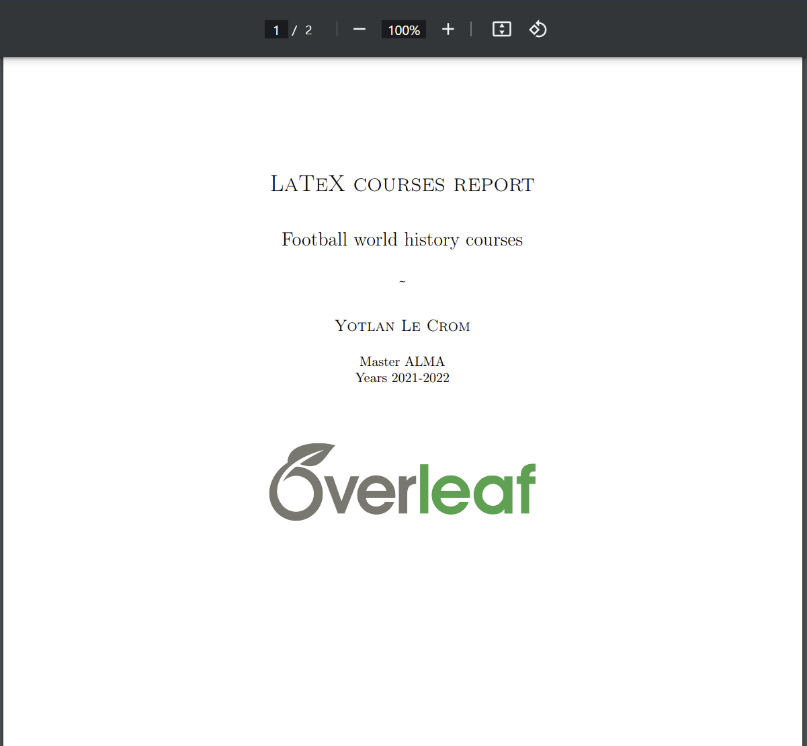

Information you should put here is :
- Object of the paper (LaTex courses report, report of the project of Football Knowledge Graph, ...)
- The name of the project (Football world history project, ...)
- Authors's names
- Student group or working group
- Years when you doing this report
- Logos of the company or school for who your work

To add these informations, follow this code :

```latex
    \begin{titlepage}
		\null	
		\vfill
	
		\centering
		
            %% Title
		
			{\LARGE\scshape LaTeX courses report}

				\vspace{1cm}	
	
			{\Large Football world history courses}

				\vspace{0.75cm}
	
			\textasciitilde
	
				\vspace{0.3cm}

		\begin{center}
		
		    %% Authors
		
		    {\large\scshape Yotlan Le Crom}

				\vspace{0.5cm}
			
			Master ALMA
			
			Years 2021-2022
		\end{center}
		
		\vspace{1cm}
		
		    %% Logo
	
		{\centering
			\includegraphics[scale=0.25]{overleaf_logo.png}
		\par}
	
			\vfill

	\end{titlepage}
```

Notice that it's important to begin and end a LaTeX file with the following commands : `\begin{document}` and `\end{document}`. Moreover, it's important to import lot of package to be able to do lot of things in your report.

## TABLE OF CONTENT

A good report have a table of content to tell to your reader the place of each part with the corresponding page number. Furthermore, it's very easy to create a table of content in LaTeX following this code :

```latex
    %- Sommaire
	\tableofcontents
	\addtocontents{toc}{\protect\thispagestyle{empty}}
	
	\setcounter{page}{1}
	\setlength{\parskip}{1em}

\newpage
```

This code give a table of contents who look like this :

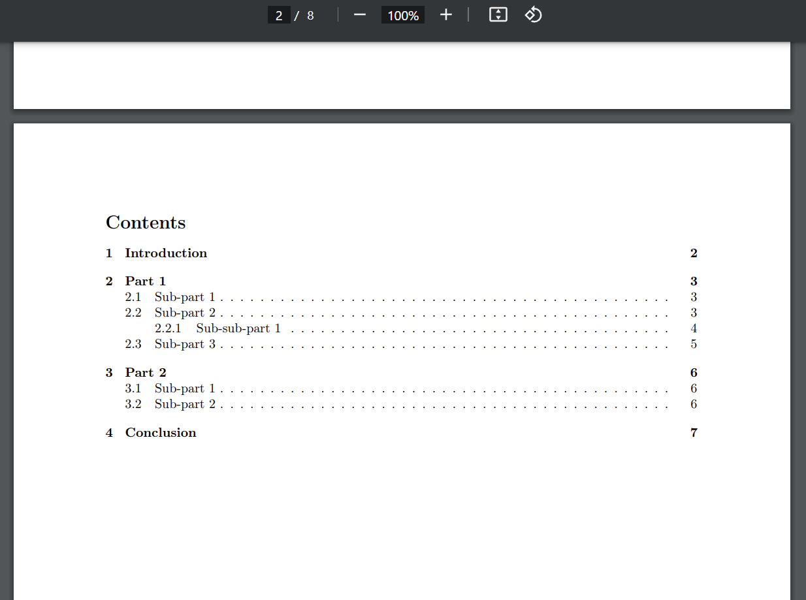

Moreover, on this page too, you not have the page number, who start only in the next page.

## SECTIONS

Your report are compose with a cover page, table of contents, but that not all. Indeed, you need to add an introduction, some sections, a conclusion and a references part. For the references part, you can find a dedicated part call [REFERENCES](#references). 

Introduction and conclusion part are just sections. So you can create them like this :

```latex
\section{Introduction}

Some text here

\section{Conclusion}

Some text here
```

Moreover, you can create subsection and subsubsection. It's very usefull when you have some specific part inside part. So create them, follow the code bellow :

```latex
\subsection{Sub-part 1}

Some text here

\subsubsection{Sub-sub-part 1}

Some text here
```

The whole example for section are in `ex/report.tex`.

## PICTURES

Pictures are very usefull when you want to show something in a report. To include an pictures in your report, you need to import them into your LaTeX project :

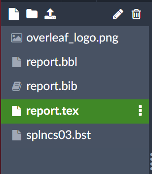

You need to click on the icon with an up arrow. When you doing this, you should have a pop up windows like this :

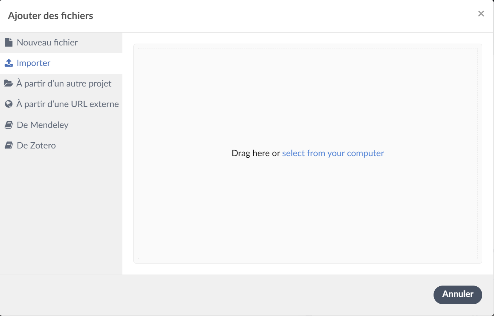

And here you can import your picture. Since your picture are imported, you can add it in your report with the same way you add the logo in the cover page :

```latex
    {\centering
			\includegraphics[scale=0.25]{overleaf_logo.png}
		\par}
```

And you can decide the size of the picture by changing the scale parameters.

### FIGURES

This part is dedicated to the figure you can create with LaTeX. I not show you the entire figure who exist in LaTeX, but few of them. If you want a specific figures, you can google it ! The LaTeX community are very active ! I give you 2 examples of figures bellow using tikz picture and pgf (2 LaTeX packages).

#### PIE CHART

You can create pie chart by following the code bellow :

```latex
\begin{figure}[!htbp]
    \centering
    \begin{tikzpicture}
    
        \pie[radius=5,text=legend]
        {
            1.27/Manchester City,
            3.02/Manchester United,
            10.48/Liverpool,
            31.43/Arsenal,
            38.73/Chelsea,
            15.08/Tottenham Hotspur
        }
    
    \end{tikzpicture}
    \hypertarget{figure1}{\caption{Percentage of goal score in the last 10 minutes in Premier League per squad}}
\end{figure}
```

You should see something like this with the code above :

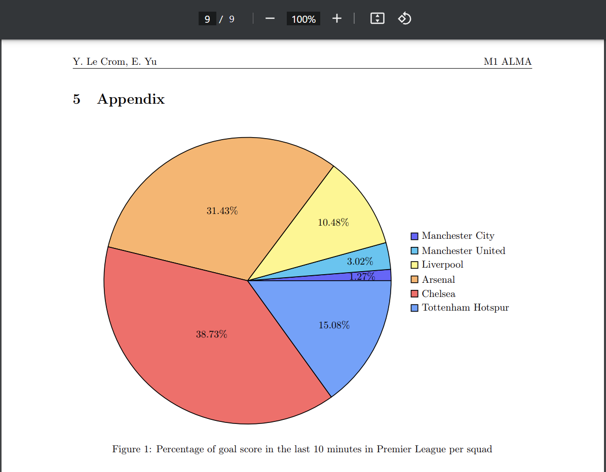

#### PLOTS

You can create plots like histogram by following the code bellow :

```latex
\begin{figure}[!htbp]
    \centering
        \begin{tikzpicture}
            \begin{axis}[
                ybar,
                symbolic x coords={Man. U., Man. C., Chel., Ars., Tott., Liv., Lei. C.},
                xlabel={Squads},
                ylabel={Victory in Premier League},
                width=10cm,height=10cm,
                ymin=0,
                xtick=data,
            ]
                \addplot table[x=squad,y=victory]{\mydata};
            \end{axis}
        \end{tikzpicture}
        \caption{Number of victory per squad in Premier League}
\end{figure}
```

You should see something like this with the code above :

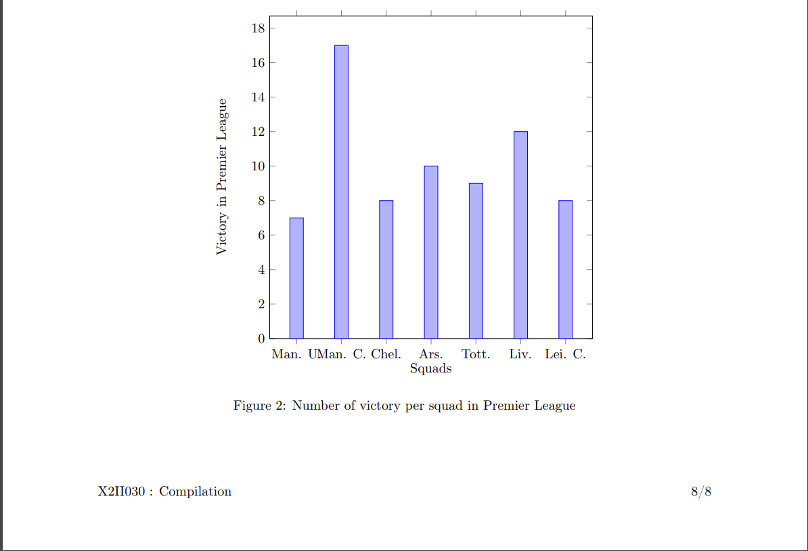

## ALGORITHMS AND CODES

### ALGORITHMS

Algorithms and codes is very important when you write a report. Indeed, these part can proove how something work. Algorithms is more mathematics than codes, who use some language specificity. To create an algorithm figures in your report, follow the code bellow :

```latex
\begin{algorithm}
    \caption{Random algorithm}
    \begin{algorithmic}
    \REQUIRE{int n}
    \ENSURE
    \FOR{i, i $\leq$ n, i++}
        \IF{i $\%$ 2 == 0}
            \STATE print(i ' is an even number')
        \ENDIF
    \ENDFOR
    \WHILE{i $\geq$ 0}
        \IF{i $\%$ 2 == 1}
            \STATE print(i ' is an odd number')
        \ENDIF
    \ENDWHILE
    \IF{n $\%$ == 0}
        \RETURN{'even'}
    \ELSE
        \RETURN{'odd'}
    \ENDIF
    \end{algorithmic}
\end{algorithm}
```

With the code above, you should see this :

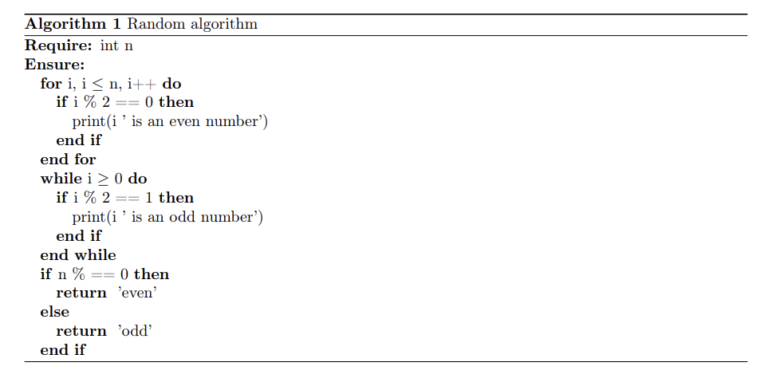

Lot of mathematician love this way to write algorithm, and in a report, because it's a pseudo-code language, it's very appreciated because you do not have some constraints due to the specitify of the language (for example : when you want to write `print('text')` in java, you need to write this `System.out.println('text')`. It's a simple case but, you can have more complex case, so pseudo-code is very usefull to give someone a way to think about what you do. It's abstract some language problem. Moreover, with the code above, you can write meta-code who is more abstract (instead of write `for i, i <= n, i++` you can write `for all int`)).

The table bellow explain you some command of the code above :

| Command   | Explanations                                                   |
|-----------|----------------------------------------------------------------|
| \caption  | Algorithm name                                                 |
| \REQUIRE  | Input parameters of the algorithm                              |
| \ENSURE   | Output of the algorithm                                        |
| \IF       | Begin if state                                                 |
| \ELSIF    | Begin elif state                                               |
| \ELSE     | Else state. Similar to the elif state, but not add an if state |
| \ENDIF    | End all if state                                               |
| \FOR      | Begin for state                                                |
| \FORALL   | Begin for all state                                            |
| \ENDFOR   | End all for state                                              |
| \WHILE    | Begin while state                                              |
| \ENDWHILE | End while state                                                |
| \RETURN   | Return state                                                   |

### CODES

Algorithms is cool, but computer scientist like too to have code in an appendix in the report to discuss about some details and choice that the developper take to make his code. But LaTeX don't implements the language style, so when you do this code bellow :

```latex
\begin{lstlisting}[language=Java]
public class Main {
    public static void main(String[] args) {
        System.out.println("Hello World !");
    }
}
\end{lstlisting}
```

You should have something like this :

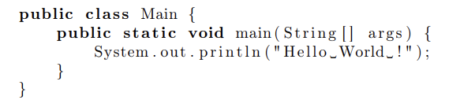

If you want to have some style, and so some color on your code part, you need to use the command `\lstdefinestyle`. In this part, I only show you the code style I use for Java, but in the file `ex/report.tex`, I give you lot of code style that you can take for your report. The code bellow set a Java style like you can see with Eclipse :

```latex
\definecolor{javared}{rgb}{0.6,0,0}                 % For strings
\definecolor{javagreen}{rgb}{0.25,0.5,0.35}         % Comments
\definecolor{javapurple}{rgb}{0.5,0,0.35}           % Keywords
\definecolor{javadocblue}{rgb}{0.25,0.35,0.75}      % Javadoc

\lstdefinestyle{javaStyle}
{language=Java,
basicstyle=\ttfamily,
keywordstyle=\color{javapurple}\bfseries,
stringstyle=\color{javared},
commentstyle=\color{javagreen},
morecomment=[s][\color{javadocblue}]{/**}{*/},
numbers=left,
numberstyle=\tiny\color{black},
stepnumber=1,
numbersep=10pt,
tabsize=4,
showspaces=false,
showstringspaces=false}
```

*Modify a little the code from here <https://texblog.org/2011/06/11/latex-syntax-highlighting-examples/>*

You first need to define some color. Here we define the color for string, comment, keyword and javadoc (multi-line comment). After that, you can start the command `\lstdefinestyle` and add the name of this style. Here the name of the style is `javaStyle`. After that, you need to specify the language (here Java), the basic style, and more important, the style of the keyword (use the color *javapurple* and bold the keyword text by using `\bfseries` **(TAKE CARE TO ADD THE FOLLOWING PACKAGE : `\usepackage{pxfonts}`)**), the style of string (use the color *javared*), the style of the comment (use the color *javagreen*) and the style of the javadoc (by using `morecomment=[s][\color{javadocblue}]{/**}{*/}`, more information about morecomment parameters here <https://www.pvv.ntnu.no/~berland/latex/docs/listings.pdf>). The others paramaters are for the general style (number at the left, tabulation, space). So when you use this style by adding `style=javaStyle` like the code bellow :

```latex
\begin{lstlisting}[language=Java, style=javaStyle]
public class Main {
    /**
     * Display string App
     */
    public static void main(String[] args) {
        // Set the string we want to display
        String str = "Hello World !";
        // Print the previous string we set
        System.out.println(str);
    }
}
\end{lstlisting}
```

You should see something like this :

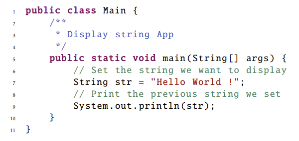

It's smoother than the older version which are just black.

## OTHER STUFFS

You can do lot of other things with LaTeX. In this part, I show you some very usefull command you can do with LaTeX. To simplify all the learning of the LaTeX command, I create a table how show you all LaTeX command :

| Command          | Result                        |
|------------------|-------------------------------|
| \textbf{Word}    | **Word**                      |
| \textif{Word}    | *Word*                        |
| \underline{Word} | __Word__                      |
| \st{Word}        | ~~Word~~                      |
| \hl{Word}        | `Word`                        |
| \newpage         | New page                      |
| \newline         | New line after a written line |
| \centering       | Centered figure               |
| \vspace          | Void space                    |
| \vfill           | Fill with void space          |

In addition, table are very usefull to show some generic result. Readers prefer table to a list when you show result, so I highly recommand you to use table when you want to show some result. The code bellow is an example of table you can create with LaTeX :

```latex
\begin{tabular}{|c|c||c|}
    \hline
    Squads & Number of victory & Total of point \\
    \hline
    Manchester City & 24 & 98 \\
    Manchester United & 14 & 54 \\
    ... & ... & ... \\
    Norwich City & 7 & 32 \\
    \hline
\end{tabular}
```

With the code above, you should see something like this :

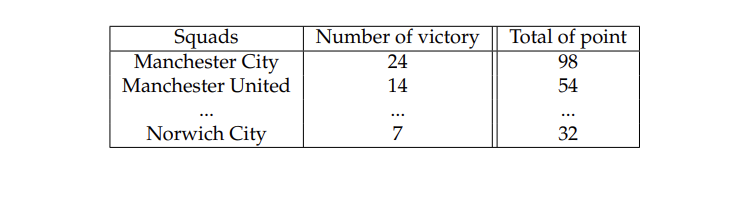

Instead of **c**, you can use **l** to fix values at the left of the cell, or **r** to fix values at the right of the cell. For more example, you can see the documentation from Overleaf here <https://fr.overleaf.com/learn/latex/Tables>. To finish with this part, I recommand you to always be simple when your write a report, because simplicity is a factor who readers love. 

## REFERENCES

When you read a report, it's important to cite other sources when you say something you didn't proove. To do this, you can do it by hand if your references part is not big, but I recommand you to do it automaticly. Indeed, with this, you can update your report, and so add other sources. You can see this in internet's articles. To add automaticly resources on your report, your need first to add the file `splncs03.bst` in your overleaf project by clicking on this button :


When you click on it, you should see a pop up windows like this :

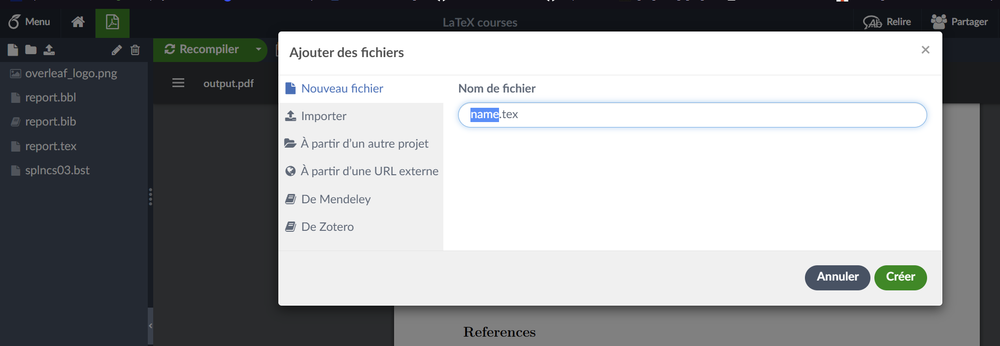

Then instead of `name.tex`, type `splncs03.bst`. When you do this, click on *Create* and you file is created ... but is empty. To add something on it, click on it in the left bar of your LaTeX project :

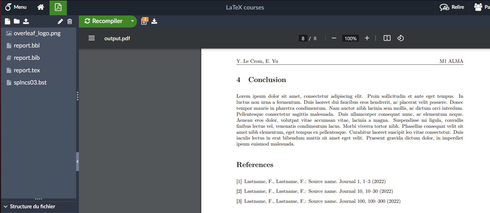

And then you should see an empty file. Add the code present in `ex/splncs03.bst` in this file. 

Since this is done, you can finally add sources. But to do this, you need to create anothers files : `report.bbl` and `report.bib`. Both of them add ressources and are important. You **need** to create both of them, not only one. We start with the `report.bbl` file. An example of this file is present in `ex/report.bbl` and bellow :

```latex
\begin{thebibliography}{10}
\providecommand{\url}[1]{\texttt{#1}}
\providecommand{\urlprefix}{URL }

\bibitem{source1}
Firstname Lastname, Firstname Lastname: Source name . Journal
  pp. 1--3 (2022)

\bibitem{source2}
Firstname Lastname, Firstname Lastname: Source name . Journal
  pp. 10--30 (2022)

\bibitem{source3}
Firstname Lastname, Firstname Lastname: Source name . Journal
  pp. 100--300 (2022)

\end{thebibliography}
```

What is important here is the command `\bibitem{source1}` who create the bibliography item for the source 1. After this, you can add :
- Firstname and Lastname of the first author
- Firstname and Lastname of the second author (if it exist, you need to add a comma between the first and the second author)
- The source name (for example LaTeX courses)
- The journal who publish this report (if it exist)
- The page numbers where the article is present in the journal
- The year of publication

This bibliography item are related with the article item in the `report.bib`. An example of this file is present in `ex/report.bib` and bellow :

```
@article{source1,
  title={Source name},
  author={Firstname Lastname and Firstname Lastname},
  journal={Journal},
  volume={1},
  pages={1--3},
  year={2022},
  publisher={Journal}
}

@article{source2,
  title={Source name},
  author={Firstname Lastname and Firstname Lastname},
  journal={Journal},
  volume={10},
  pages={10--30},
  year={2022},
  publisher={Journal}
}

@article{source3,
  title={Source name},
  author={Firstname Lastname and Firstname Lastname},
  journal={Journal},
  volume={100},
  pages={100--300},
  year={2022},
  publisher={Journal}
}
```

You can see that each precision we add in the bibliography item is present in the article item. Moreover, we replace comma by and to separate the authors, and add the specification of the publisher of the article (normally it's the publisher of the journal). If you don't have some information, you can not specify them in the `report.bbl` and in the article item, you can just replace {something} by {}.

To conclude this, you need to add these command in your file `report.tex` to start the references part :

```latex
\bibliographystyle{splncs03}
\bibliography{report}
```

I recommand you to always add the references part **after** the conclusion part to not confuse the reader of your report. Moreover, to cite a paper of your bibliography, use this command `\cite{mypaperreference}`, and in your text, an automatic link are created between where you cite the paper and bibliography.