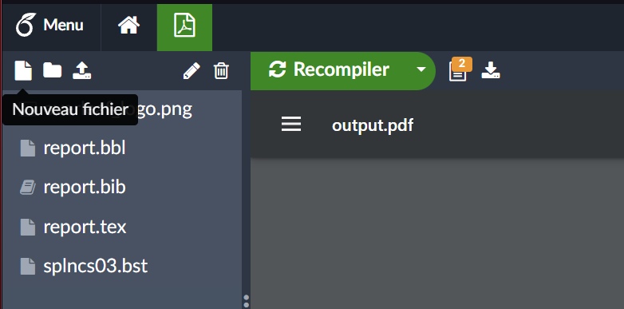

# LATEX COURSES

## TABLE OF CONTENTS

## GETTING START

Write a report with LaTeX is very usefull. In this short courses, I share you my personnal LaTeX template to write report. But first of all, you need to go on Overleaf website (by clicking on this link <https://fr.overleaf.com>) and create an account (or connect on it). When you do that, go on this link <https://fr.overleaf.com/project> and your normally see all your report, call here "project". You can start a project by clicking on the green button *New project* and select *Empty project*. When you do this, you normaly arrive in a page like this :


Here it's the french version, but do not care about it. What is important is the render of this page. You can see lot of things like *Recompile* or *Share*. If you want to allow someone to read or write on your LaTeX document, click on *Share* button and you get a pop up windows like this :


Here you can decide to add by hand people who can read/write on your report by adding their mail (and so by doing this, you send an invitation to the other user who need to accept if he want to read/write). But you can decide to share your report with other people by clicking on *Activate link sharing*. Once you doing this, you can close the pop up windows.

Before we start, the full example of this courses is present in `ex/report.tex`.

## COVER PAGE

If you don't want a cover page in your report, skip this part. Cover page is important to give a good impression to your reader. Indeed, you need to do a very good cover page with the maximum information you can give. Bellow, I give you an example of a cover page you can do :


Information you should put here is :
- Object of the paper (LaTex courses report, report of the project of Football Knowledge Graph, ...)
- The name of the project (Football world history project, ...)
- Authors's names
- Student group or working group
- Years when you doing this report
- Logos of the company or school for who your work

To add these informations, follow this code :

```latex
    \begin{titlepage}
		\null	
		\vfill
	
		\centering
		
            %% Title
		
			{\LARGE\scshape LaTeX courses report}

				\vspace{1cm}	
	
			{\Large Football world history courses}

				\vspace{0.75cm}
	
			\textasciitilde
	
				\vspace{0.3cm}

		\begin{center}
		
		    %% Authors
		
		    {\large\scshape Yotlan Le Crom}

				\vspace{0.5cm}
			
			Master ALMA
			
			Years 2021-2022
		\end{center}
		
		\vspace{1cm}
		
		    %% Logo
	
		{\centering
			\includegraphics[scale=0.25]{overleaf_logo.png}
		\par}
	
			\vfill

	\end{titlepage}
```

Notice that it's important to begin and end a LaTeX file with the following commands : `\begin{document}` and `\end{document}`. Moreover, it's important to import lot of package to be able to do lot of things in your report.

## TABLE OF CONTENT

A good report have a table of content to tell to your reader the place of each part with the corresponding page number. Furthermore, it's very easy to create a table of content in LaTeX following this code :

```latex
    %- Sommaire
	\tableofcontents
	\addtocontents{toc}{\protect\thispagestyle{empty}}
	
	\setcounter{page}{1}
	\setlength{\parskip}{1em}

\newpage
```

This code give a table of contents who look like this :


Moreover, on this page too, you not have the page number, who start only in the next page.

## REFERENCES

When you read a report, it's important to cite other sources when you say something you didn't proove. To do this, you can do it by hand if your references part is not big, but I recommand you to do it automaticly. Indeed, with this, you can update your report, and so add other sources. You can see this in internet's articles. To add automaticly resources on your report, your need first to add the file `splncs03.bst` in your overleaf project by clicking on this button :



When you click on it, you should see a pop up windows like this :


Then instead of `name.tex`, type `splncs03.bst`. When you do this, click on *Create* and you file is created ... but is empty. To add something on it, click on it in the left bar of your LaTeX project :


And then you should see an empty file. Add the code present in `ex/splncs03.bst` in this file. 

Since this is done, you can finally add sources. But to do this, you need to create anothers files : `report.bbl` and `report.bib`. Both of them add ressources and are important. You **need** to create both of them, not only one. We start with the `report.bbl` file. An example of this file is present in `ex/report.bbl` and bellow :

```latex
\begin{thebibliography}{10}
\providecommand{\url}[1]{\texttt{#1}}
\providecommand{\urlprefix}{URL }

\bibitem{source1}
Firstname Lastname, Firstname Lastname: Source name . Journal
  pp. 1--3 (2022)

\bibitem{source2}
Firstname Lastname, Firstname Lastname: Source name . Journal
  pp. 10--30 (2022)

\bibitem{source3}
Firstname Lastname, Firstname Lastname: Source name . Journal
  pp. 100--300 (2022)

\end{thebibliography}
```

What is important here is the command `\bibitem{source1}` who create the bibliography item for the source 1. After this, you can add :
- Firstname and Lastname of the first author
- Firstname and Lastname of the second author (if it exist, you need to add a comma between the first and the second author)
- The source name (for example LaTeX courses)
- The journal who publish this report (if it exist)
- The page numbers where the article is present in the journal
- The year of publication

This bibliography item are related with the article item in the `report.bib`. An example of this file is present in `ex/report.bib` and bellow :

```
@article{source1,
  title={Source name},
  author={Firstname Lastname and Firstname Lastname},
  journal={Journal},
  volume={1},
  pages={1--3},
  year={2022},
  publisher={Journal}
}

@article{source2,
  title={Source name},
  author={Firstname Lastname and Firstname Lastname},
  journal={Journal},
  volume={10},
  pages={10--30},
  year={2022},
  publisher={Journal}
}

@article{source3,
  title={Source name},
  author={Firstname Lastname and Firstname Lastname},
  journal={Journal},
  volume={100},
  pages={100--300},
  year={2022},
  publisher={Journal}
}
```

You can see that each precision we add in the bibliography item is present in the article item. Moreover, we replace comma by and to separate the authors, and add the specification of the publisher of the article (normally it's the publisher of the journal). If you don't have some information, you can not specify them in the `report.bbl` and in the article item, you can just replace {something} by {}.

To conclude this, you need to add these command in your file `report.tex` to start the references part :

```latex
\bibliographystyle{splncs03}
\bibliography{report}
```

I recommand you to always add the references part **after** the conclusion part to not confuse the reader of your report.